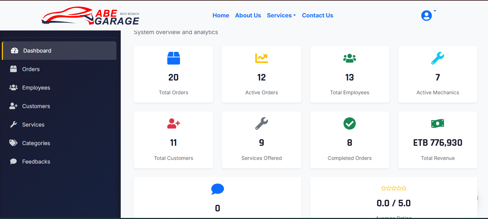
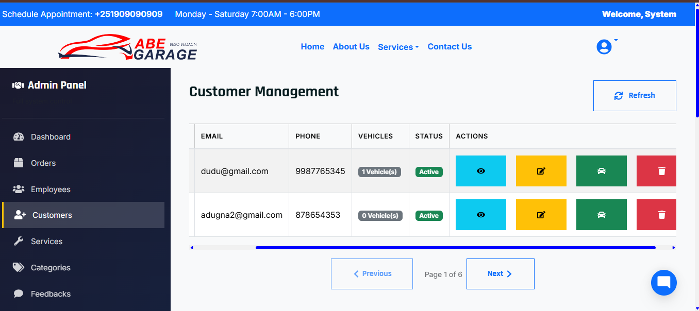
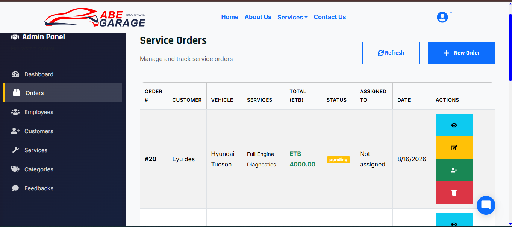

# 🚗 Asela Garage Management System

A full-stack automotive garage management system built to help garages manage **customers, vehicles, employees, services, service orders, tasks, feedback, and real-time updates** in one platform.

The application includes **role-based access control** for administrators, managers, employees/mechanics, and customers.

🌐 **Live Demo:** https://asela-garage-management.netlify.app
🔧 **Backend API:** https://asela-garage-backend-production.up.railway.app

---

## 📸 Screenshots

### 🔐 Authentication


### 📊 Dashboard



### 👥 Customer & Employee Management



### 🚗 Vehicle & Service Management


### 📋 Service Orders & Tasks



> Replace the image paths above with your actual screenshot filenames after adding them to the repository.

---

## ✨ Key Features

### 🔐 Authentication & Authorization

* JWT-based authentication
* Secure password hashing with bcrypt
* Protected routes
* Role-based access control
* Separate interfaces for different user roles

### 👥 Customer Management

* Create, view, update, and delete customers
* Search and manage customer information
* View customer-related service information

### 🚗 Vehicle Management

* Register customer vehicles
* Manage vehicle information
* Connect vehicles with customers and service orders
* Track vehicle service history

### 🔧 Service & Order Management

* Manage garage services
* Create and manage service orders
* Assign tasks to employees/mechanics
* Track order and task status
* Manage active service operations

### 👨‍🔧 Employee & Mechanic Management

* Manage employees
* Assign service tasks
* View assigned tasks
* Track employee activities

### 💬 Feedback

* Customers can submit feedback
* Garage staff can manage and review feedback

### ⚡ Real-Time Updates

* Real-time task and order updates using **Socket.IO**
* Reduces the need for users to manually refresh the application

### 📊 Dashboard & Analytics

* Dashboard-based management
* Data visualization and statistics
* Charts for monitoring garage information

### 🤖 AI Chatbot

* Integrated AI chatbot for interactive assistance
* Provides users with an additional way to interact with the application

---

## 👤 User Roles

| Role                      | Main Responsibilities                                        |
| ------------------------- | ------------------------------------------------------------ |
| 👑 Admin                  | Manage users and major system resources                      |
| 🧑‍💼 Manager             | Monitor garage operations, employees, services, and orders   |
| 👨‍🔧 Employee / Mechanic | Manage assigned tasks and service activities                 |
| 👤 Customer               | Manage vehicles, view services, orders, and provide feedback |

---

| Frontend                          | Backend                         | Database            | Deployment                |
| --------------------------------- | ------------------------------- | ------------------- | ------------------------- |
| React.js · Vite · JavaScript      | Node.js · Express.js · REST API | MySQL · mysql2      | Netlify · Railway · Aiven |
| React Router · Axios · Bootstrap  | JWT · bcrypt · Socket.IO        | Relational Database | Cloud Deployment          |
| Chart.js · Recharts · React Icons | CORS · dotenv                   |                     |                           |


## 🏗️ System Architecture

```text
                    👥 Users
                       │
        ┌──────────────┼──────────────┐
        │              │              │
      Admin         Employee       Customer
        │              │              │
        └──────────────┼──────────────┘
                       ▼
              React + Vite Frontend
                       │
                REST API / Socket.IO
                       │
                       ▼
              Node.js + Express.js
                       │
                       ▼
                  MySQL Database
                       │
                       ▼
                  Aiven MySQL
```

---

## 📂 Project Structure

```text
asela-garage-management-system/
│
├── Backend/
│   ├── config/
│   ├── controllers/
│   ├── middlewares/
│   ├── routes/
│   ├── services/
│   ├── services/sql/
│   ├── app.js
│   └── package.json
│
├── frontend/
│   ├── public/
│   ├── src/
│   ├── package.json
│   └── vite.config.js
│
├── .gitignore
└── README.md
```

---

## 🔌 Backend API

The backend is built with **Node.js and Express.js** and provides REST API endpoints for the frontend.

The backend is organized into separate layers for better maintainability:

```text
Routes
   ↓
Controllers
   ↓
Services
   ↓
SQL / Database
```

The production API is deployed on Railway:

🔧 **https://asela-garage-backend-production.up.railway.app**

---

## ⚡ Real-Time Communication

**Socket.IO** is used to provide real-time communication between connected users.

This is mainly used for areas such as:

* Service order updates
* Employee task updates
* Status changes
* Real-time application notifications/updates

---

## 🗄️ Database

The system uses **MySQL** as its relational database.

The database manages information including:

* Users
* Customers
* Employees
* Vehicles
* Services
* Service orders
* Tasks
* Feedback
* Authentication-related data

The production database is hosted on **Aiven MySQL**.

---

## 🔐 Security

Security-related implementation includes:

* JWT authentication
* Role-based authorization
* Password hashing with bcrypt
* Protected API routes
* Environment variables for sensitive configuration
* CORS configuration

> ⚠️ Sensitive information such as passwords, API keys, JWT secrets, and `.env` files should never be committed to GitHub.

---

## 🚀 Live Deployment

The project is deployed as a complete full-stack application:

```text
Frontend
   ↓
Netlify
   ↓
Railway Backend
   ↓
Aiven MySQL
```

### 🌐 Frontend

https://asela-garage-management.netlify.app

### 🔧 Backend

https://asela-garage-backend-production.up.railway.app

---

## 💻 Run Locally

### Prerequisites

* Node.js
* npm
* MySQL

### Backend

```bash
cd Backend
npm install
npm start
```

Create a `.env` file containing your database and authentication configuration.

Example:

```env
PORT=8000

DB_HOST=localhost
DB_PORT=3306
DB_USER=root
DB_PASSWORD=your_password
DB_NAME=garage_db

JWT_SECRET=your_secret
```

### Frontend

```bash
cd frontend
npm install
npm run dev
```

Configure the frontend API URL in the appropriate Vite environment variable.

Example:

```env
VITE_API_URL=http://localhost:8000
```

> Never commit real passwords, API keys, or other secrets to GitHub.

---

## 📚 What I Learned

This project gave me practical experience with:

* Full-stack application development
* React and component-based UI development
* Node.js and Express.js
* REST API development
* MySQL database integration
* JWT authentication and authorization
* Role-based access control
* Real-time communication with Socket.IO
* API integration with Axios
* Git and GitHub
* Environment variable management
* Cloud deployment
* Debugging frontend and backend issues
* Connecting a production backend with a cloud database

---

## 🎯 Project Goals

The main goals of the project were to:

* Digitize garage management processes
* Reduce manual record keeping
* Centralize customer and vehicle information
* Improve service-order management
* Make employee task assignment easier
* Provide customers with better access to their service information
* Demonstrate a complete production-deployed full-stack application

---

## 👨‍💻 Author

### Eyosiyas Hailemichael

**Junior Full-Stack Developer**

Interested in building practical web applications using modern frontend, backend, database, and cloud technologies.

🔗 **GitHub:** https://github.com/eyosi-ai-leader

---

## ⭐ Project

If you find this project interesting, feel free to ⭐ the repository.
